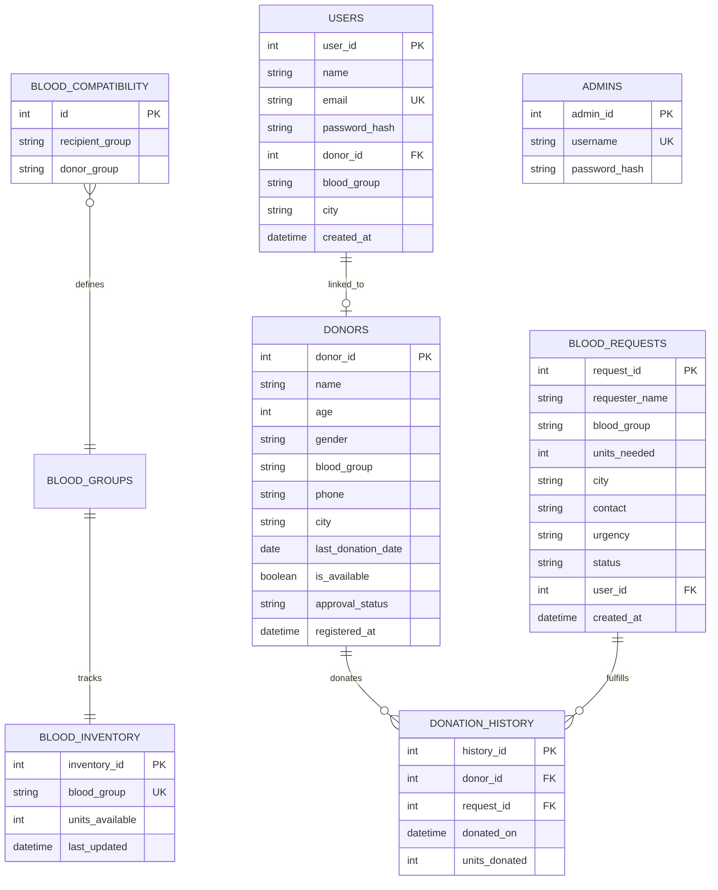

# Blood Donation Management System (BloodConnect)

A full-stack DBMS project designed to manage blood donations, donor availability, and emergency blood requests. This application demonstrates database design principles, including relational mapping, complex queries, and data integrity.

## 📊 Database Architecture

The core of this project is a relational database implemented using **MySQL/MariaDB** and **SQLAlchemy (ORM)**.

### Entity-Relationship (ER) Diagram



### Table Definitions & Advanced Constraints

1.  **Donors**: Stores donor profiles. Includes `approval_status` (Pending/Approved/Rejected) to ensure only verified donors appear in searches.
2.  **Blood Requests**: Tracks patient needs. Requests from logged-in users are automatically verified against their profile data.
3.  **Blood Compatibility**: A dedicated mapping table used by the **Smart Matching Algorithm** to determine compatible donor groups for any recipient.
4.  **Stored Procedures**: 
    *   `GetDonorEligibility`: Calculates real-time eligibility based on the 90-day cooldown rule and availability status.
    *   `FindMatchingDonors`: Implements the smart matching logic, prioritizing local donors and ranking them by readiness.
5.  **MySQL Triggers**:
    *   `prevent_negative_inventory`: A `BEFORE UPDATE` trigger that enforces data integrity by blocking transactions that would result in negative stock.
    *   `auto_increment_inventory`: An `AFTER INSERT` trigger on `DonationHistory` that automatically updates the bank stock.

## 🔒 Privacy Protection

To protect donor privacy, contact information (phone numbers) is **masked** for public viewers (e.g., `1234******`). Full contact details are only visible to:
*   **Admins**: After logging into the Admin Portal.
*   **Registered Users**: After logging into their Patient/Seeker account.

This ensures that sensitive donor data is only accessible to authenticated individuals who have registered with the platform.

---

## 🔍 Key SQL Implementations


### Analytics Aggregation
The dashboard statistics are fetched using a single optimized SQL query involving subqueries and joins to provide a snapshot of the entire system state:

```sql
SELECT 
    (SELECT COUNT(*) FROM donors) as total_donors,
    (SELECT COUNT(*) FROM blood_requests WHERE status = 'pending') as pending_requests,
    (SELECT COUNT(*) FROM blood_requests WHERE status = 'fulfilled') as fulfilled_requests,
    COUNT(d.donor_id) as active_donors_count 
FROM donors d
LEFT JOIN donation_history dh ON d.donor_id = dh.donor_id
WHERE d.is_available = 1;
```

---

## 🛠️ Tech Stack
- **Frontend**: React (Vite), Tailwind CSS, Lucide React (Icons).
- **Backend**: Flask (Python), SQLAlchemy (ORM).
- **Database**: MySQL/MariaDB.
- **State Management**: React Hooks & Context-like architecture.

---

## 🚀 Setup & Execution

### 1. Prerequisites
- Python 3.8+
- Node.js 18+

### 2. Database Setup
Ensure you have MySQL or MariaDB running. Log into your MySQL shell:
```sql
CREATE DATABASE bloodconnect;
```

### 3. Backend Setup
```powershell
cd backend
python -m venv venv
.\venv\Scripts\activate
pip install -r requirements.txt
python app.py
```
*The tables will be automatically created and seeded with sample data on the first run.*

### 3. Frontend Setup
```powershell
cd frontend
npm install
npm run dev
```
Open [http://localhost:5173](http://localhost:5173) in your browser.

---

## 🔐 Admin Credentials
Access the admin portal at `/admin/login`.
- **Username**: `admin`
- **Password**: `admin123`
